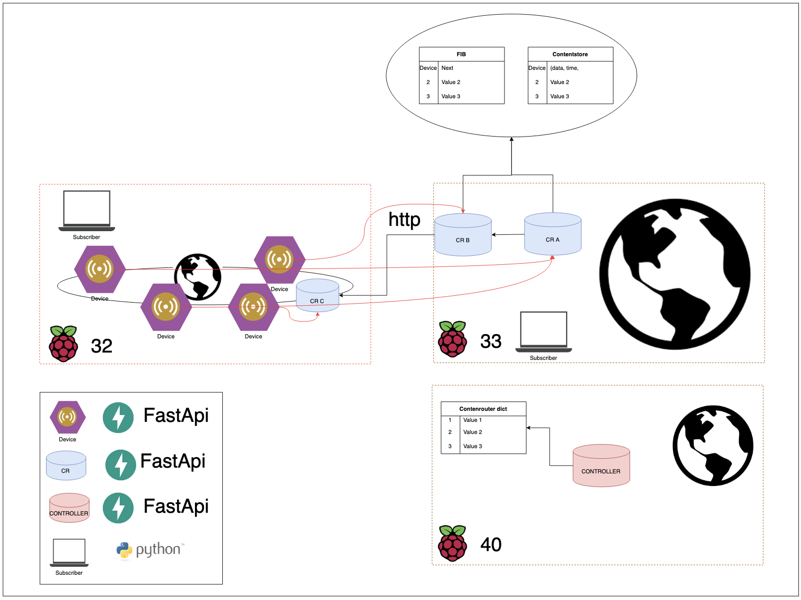

# CS7NS1-Group16

A repository for the CS7NS1 Group Project for the furfilling of the requirements of the module CS7NS1 - Scalable Computing in Trinity College Dublin.
The following Repository tries to implemnet/simulate a named data networking architecture by utilizinh pyton with the FastApi and Requests libraries.

## Group Members


## Architecture Overview

The architecture of our system is shown in the following diagram:




## How to run the system


### Local

To run the system you need to install the required dependencies. To do this, run the following command:
```bash
 pip install -r requirements.txt
```
this works on macos and on the raspberry pi. If you are using a different OS, you may need to install the dependencies manually, since we have not tested the system on other OSs.

To run the system, on your local machine, run the following command from the  `api`  directory:
```bash
 sh run.sh
```
This will start two contentrouter instances, one controller node and 5 devices on your machine in silent mode.

To stop the system run the following command:
```bash
 sh kill.sh
```
## Raspberry Pi

Copy the repository to the macneil server instance and  move it to a folder called project3. This could be done with vs code remote server. Since the macneil file system is linked to the raspberry pi, everything will be on the raspberry pi.

To run the System on the Raspberry Pi, a few more additional steps are required. First, you need to install the required dependencies as before. To do this, run the following command on **every** Raspberry Pi you want to run the system on:
```bash
 pip install -r requirements.txt
```
Then an ssh key needs to be generated on the machine you are running the system from. To do this, run the following command:
```bash
ssh-keygen -t ed25519 -C "$(some)@$(mailprovider).com"
```
then copy the public key to the Raspberry Pi. To do this, run the following command:
```bash
ssh -i $(path to private key) $(user)@$(raspi ip)
```
This has to be done for every Raspberry Pi you want to run the system on.

Have a look at `api/run_pi_example.sh` to see how a working run file looks like. Then go to the `api/run_pi.sh` file and change the username to your username and the ip addresses to the ip addresses of the Raspberry Pis you want to run the system on. Then run the following command from the `api` directory:
```bash
sh run_pi.sh
```

This will start two contentrouter instances, one controller node and 5 devices on 3 Raspberry Pis in silent mode.
The processes can be stopped with the following command (after changing the username to you username and the ip addresses to the ip addresses of the Raspberry Pis you want to run the system on an example is given in `api/kill_pi_example.sh`):
```bash
sh kill_pi.sh
```
When restarting the system with the run command agian it will restore every value saved. This means that the system will continue to run as if it was never stopped – since the uvicorn restarts when encouterering an error our system is able to recover from errors.